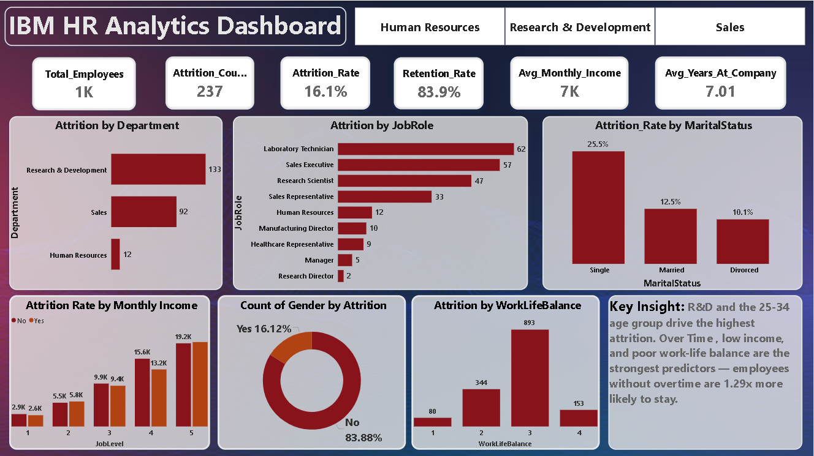
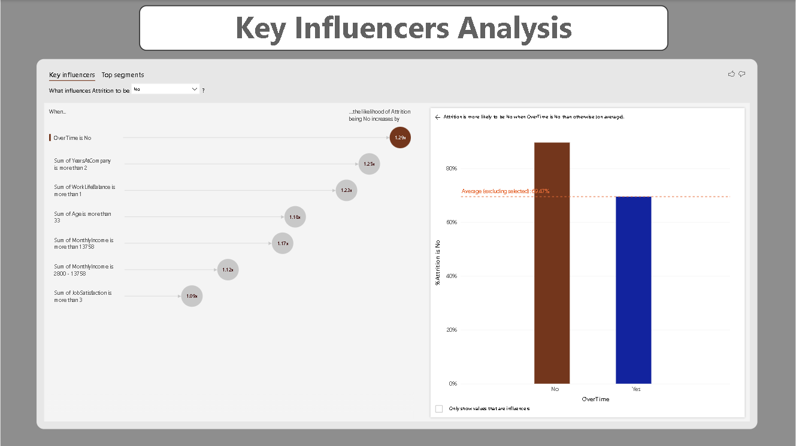

# IBM HR Analytics Dashboard 📊

A two-page interactive Power BI dashboard analyzing employee attrition 
patterns and key influencing factors, built using the IBM HR Employee 
Attrition dataset.

## 🎯 Objective
Identify patterns and key drivers of employee attrition to support 
HR decision-making on retention strategies.

## 🛠️ Tools Used
- Power BI Desktop
- DAX (Data Analysis Expressions)
- Power Query (Data Cleaning & Transformation)
- Power BI Key Influencers (AI Visual)

## 📌 Dashboard Structure

### Page 1 — Overview
- **KPI Cards:** Total Employees, Attrition Count, Attrition Rate, 
  Retention Rate, Avg Monthly Income, Avg Years at Company
- **Attrition by Department** — Research & Development highest at 133
- **Attrition by Job Role** — Laboratory Technician highest at 62
- **Attrition Rate by Marital Status** — Single employees at 25.5%
- **Attrition Rate by Monthly Income** (across Job Levels)
- **Count of Gender by Attrition**
- **Attrition by Work-Life Balance**
- **Interactive Slicers:** Department, OverTime
- **Key Insight summary box**

### Page 2 — Key Influencers Analysis
- Power BI's AI-powered Key Influencers visual identifying the 
  strongest predictors of attrition
- Shows likelihood multipliers for factors like OverTime, tenure, 
  work-life balance, age, and income

## 🔍 Key Insights
- **Research & Development** has the highest attrition (133 employees)
- **Single employees** show the highest attrition rate (25.5%) vs 
  Married (12.5%) and Divorced (10.1%)
- **OverTime is the strongest predictor** — employees without overtime 
  are 1.29x more likely to stay
- Longer tenure (>2 years), better work-life balance, higher age (>33), 
  and higher income (>₹13,758) all correlate with retention
- Male attrition (63.3%) is notably higher than female (36.7%)

## 📷 Dashboard Preview

### Page 1 — Overview

### Page 2 — Key Influencers

## 📂 Dataset
IBM HR Analytics Employee Attrition & Performance dataset (Kaggle)
1,470 employee records, 35 attributes

## 👤 Author
**Pranjal Waim**  
Data Analyst Intern @ Syntecxhub  
[LinkedIn](https://linkedin.com/in/pranjal) | [GitHub](https://github.com/Pranjalwaim)
